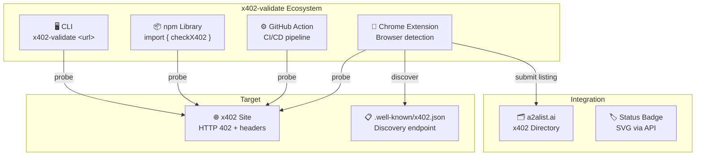
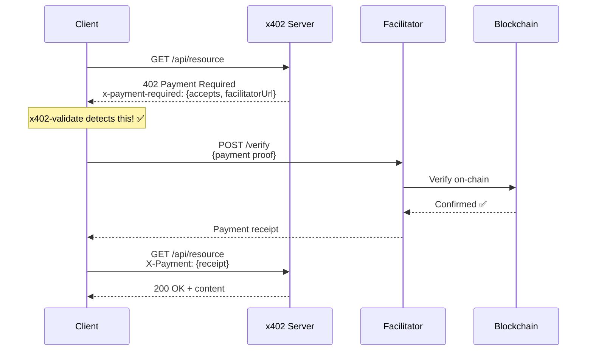
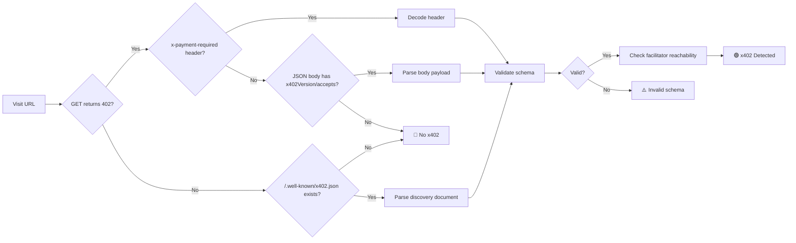
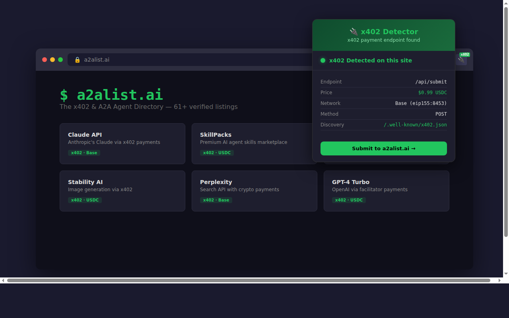
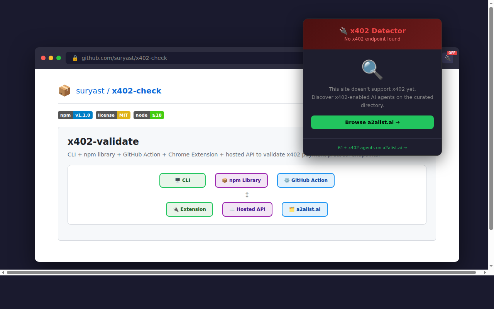
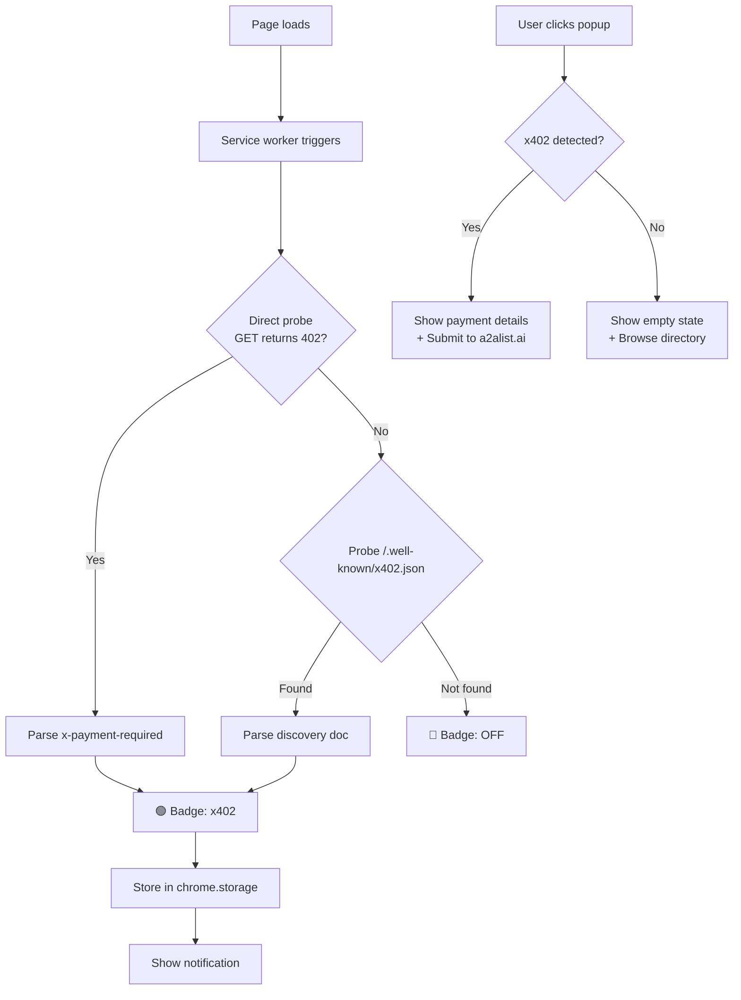

# x402-validate

<p align="center">
  
</p>

<p align="center">
  <a href="https://www.npmjs.com/package/x402-validate"></a>
  <a href="LICENSE"></a>
  <a href="https://nodejs.org">= 18" /></a>
</p>

**CLI + library + GitHub Action + Chrome Extension** to validate [x402 HTTP payment protocol](https://x402.org) endpoints.

Detects x402-enabled endpoints via **headers and JSON body**, decodes `PaymentRequired` payloads, validates schema compliance, checks facilitator reachability, generates status badges, and monitors endpoints in watch mode.

---

## Architecture



## How x402 Works



## Detection Flow



---

## Components

| Component | Description | Location |
|-----------|-------------|----------|
| **CLI** | Command-line checker with colored output | `src/cli.ts` |
| **Library** | Importable npm package | `src/index.ts` |
| **GitHub Action** | CI/CD integration, zero deps | `action/` |
| **Chrome Extension** | Browser-native x402 detection | `extension/` |


---

## Quick Start

```bash
# Install globally
npm install -g x402-validate

# Check a URL
x402-validate https://pay.skillpacks.dev/api/skills/security-suite

# Verbose: schema validation + facilitator check
x402-validate --verbose https://pay.skillpacks.dev/api/skills/security-suite

# JSON output for CI
x402-validate --json https://api.example.com/resource | jq .
```

### Output

```
✅ x402 DETECTED  https://pay.skillpacks.dev/api/skills/security-suite
  Status:      402
  Network:     eip155:8453
  Scheme:      exact
  Amount:      990000
  Resource:    https://pay.skillpacks.dev/api/skills/security-suite
  Pay to:      0xb92aab592c...
  Schema:      ✅ Valid
  Facilitator: ✅ Reachable (HTTP 200)
```

---

## CLI Reference

```bash
x402-validate [options] <url> [url...]
```

| Flag | Description |
|------|-------------|
| `--json` | Machine-readable JSON output |
| `--verbose` | Schema validation + facilitator check |
| `--timeout <ms>` | Request timeout (default: `10000`) |
| `--file <path>` | Read URLs from file (one per line, `#` comments) |
| `--badge <path>` | Generate SVG status badge |
| `--watch <secs>` | Re-check every N seconds |
| `--help` | Show help |
| `--version` | Show version |

### Exit Codes

| Code | Meaning |
|------|---------|
| `0` | x402 detected on at least one URL |
| `1` | No x402 detected |
| `2` | Error (network, timeout, invalid args) |

### Examples

```bash
# Check multiple URLs
x402-validate https://api.a.com/paid https://api.b.com/endpoint

# Read URLs from file
echo "https://pay.skillpacks.dev/api/skills/security-suite" > urls.txt
x402-validate --file urls.txt

# Generate a badge
x402-validate --badge badge.svg https://api.example.com/resource

# Watch mode — re-check every 60 seconds
x402-validate --watch 60 https://api.example.com/resource

# CI — exits 0 if x402 found
x402-validate https://api.example.com/resource && echo "x402 active!"
```

---

## Library API

```typescript
import {
  checkX402,
  validateSchema,
  checkFacilitator,
  decodePaymentRequired,
} from 'x402-validate';
```

### `checkX402(url, options?)`

```typescript
const result = await checkX402('https://api.example.com/resource', {
  timeout: 10000,
  verbose: true,
  checkFacilitator: true,
});

if (result.supported) {
  console.log('x402 detected!', result.paymentDetails);
  console.log('Schema valid?', result.schemaValidation?.valid);
  console.log('Facilitator up?', result.facilitatorCheck?.reachable);
}
```

### `validateSchema(payload)`

```typescript
const validation = validateSchema({
  x402Version: 1,
  accepts: [{
    scheme: 'exact',
    network: 'base-mainnet',
    maxAmountRequired: '1000000',
    resource: 'https://example.com/api',
    description: 'Access to AI API',
    mimeType: 'application/json',
    payTo: '0xDeadBeef',
    maxTimeoutSeconds: 300,
  }],
  facilitatorUrl: 'https://facilitator.example.com',
});

console.log(validation.valid);    // true
console.log(validation.errors);   // []
```

### `checkFacilitator(url, timeout?)`

```typescript
const fc = await checkFacilitator('https://facilitator.example.com', 5000);
// fc.reachable: true if 2xx/3xx
```

---

## GitHub Action

Zero-dependency composite action for CI/CD pipelines.

```yaml
- name: Verify x402 endpoint
  uses: suryast/x402-validate@master
  with:
    urls: |
      https://pay.skillpacks.dev/api/skills/security-suite
      https://a2alist.ai/api/submit
    fail-on-missing: 'true'
    timeout: '15000'
```

### Inputs

| Input | Required | Default | Description |
|-------|----------|---------|-------------|
| `urls` | ✅ | — | Newline-separated URLs to check |
| `fail-on-missing` | ❌ | `false` | Fail the step if any URL lacks x402 |
| `timeout` | ❌ | `10000` | Request timeout in ms |

### Outputs

| Output | Description |
|--------|-------------|
| `results` | JSON array of check results |
| `found-count` | Number of URLs with x402 |
| `total-count` | Total URLs checked |

### Workflow Examples

```yaml
# Scheduled monitoring
name: x402 Monitor
on:
  schedule:
    - cron: '0 */6 * * *'  # Every 6 hours
jobs:
  check:
    runs-on: ubuntu-latest
    steps:
      - uses: suryast/x402-validate@master
        with:
          urls: https://pay.skillpacks.dev/api/skills/security-suite
          fail-on-missing: 'true'

# PR gate — ensure x402 stays active
name: x402 Gate
on: [pull_request]
jobs:
  verify:
    runs-on: ubuntu-latest
    steps:
      - uses: suryast/x402-validate@master
        id: x402
        with:
          urls: https://your-api.com/paid-endpoint
          fail-on-missing: 'true'
      - run: echo "Found ${{ steps.x402.outputs.found-count }} x402 endpoints"
```

---

## Chrome Extension

MV3 Chrome extension that passively detects x402 endpoints while you browse.

### Features

- 🟢 Green **x402** badge when x402 detected on current site
- 🔴 Red **OFF** badge when no x402 found
- Auto-discovers via `/.well-known/x402.json`
- Stores discovered x402 sites locally
- One-click submit to [a2alist.ai](https://a2alist.ai) directory
- Export discovered sites as JSON
- Built-in directory browser (powered by a2alist.ai)

### Screenshots

| x402 Detected | Not Found |
|:-:|:-:|
|  |  |

### Install

1. Download or clone `extension/` directory
2. Open `chrome://extensions`
3. Enable **Developer mode**
4. Click **Load unpacked** → select `extension/`

### How It Works



### Privacy

- No data sent automatically — submission is user-initiated only
- Discovered sites stored locally in `chrome.storage.local`
- Extension only makes HEAD/GET probes to detect x402 headers

---

---

## x402 Discovery Standard

This project introduces `/.well-known/x402.json` as a discovery mechanism for x402-enabled sites. Sites that use x402 on specific endpoints (not the homepage) can advertise their x402 support:

```json
{
  "x402Version": 1,
  "endpoints": [
    {
      "path": "/api/submit",
      "method": "POST",
      "description": "Paid API endpoint",
      "price": "$0.99 USDC",
      "network": "eip155:8453"
    }
  ]
}
```

This enables passive detection by browser extensions and crawlers without probing every route.

---

## Types

<details>
<summary>TypeScript interfaces</summary>

### `X402Result`

```typescript
interface X402Result {
  url: string;
  supported: boolean;
  status: number;
  paymentDetails?: PaymentRequired;
  rawHeader?: string;
  headers?: Record<string, string>;
  error?: string;
  schemaValidation?: ValidationResult;
  facilitatorCheck?: FacilitatorResult;
}
```

### `ValidationResult`

```typescript
interface ValidationResult {
  valid: boolean;
  errors: string[];
  warnings: string[];
}
```

### `FacilitatorResult`

```typescript
interface FacilitatorResult {
  url: string;
  reachable: boolean;
  status?: number;
  error?: string;
}
```

### `PaymentRequired`

```typescript
interface PaymentRequired {
  x402Version?: number;
  accepts?: AcceptsEntry[];
  facilitatorUrl?: string;
  scheme?: string;
  network?: string;
  maxAmountRequired?: string;
}
```

</details>

---

## Related

- [x402.org](https://x402.org) — x402 protocol spec
- [coinbase/x402](https://github.com/coinbase/x402) — Reference implementation
- [a2alist.ai](https://a2alist.ai) — x402 & A2A agent directory
- [skillpacks.dev](https://skillpacks.dev) — AI skills marketplace (x402-powered)

---

## License

MIT © [a2alist.ai](https://a2alist.ai)
