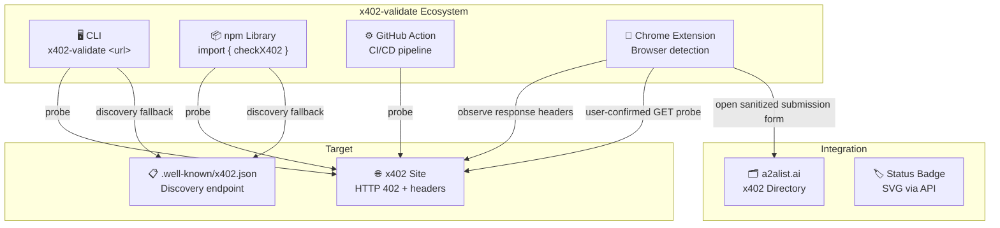
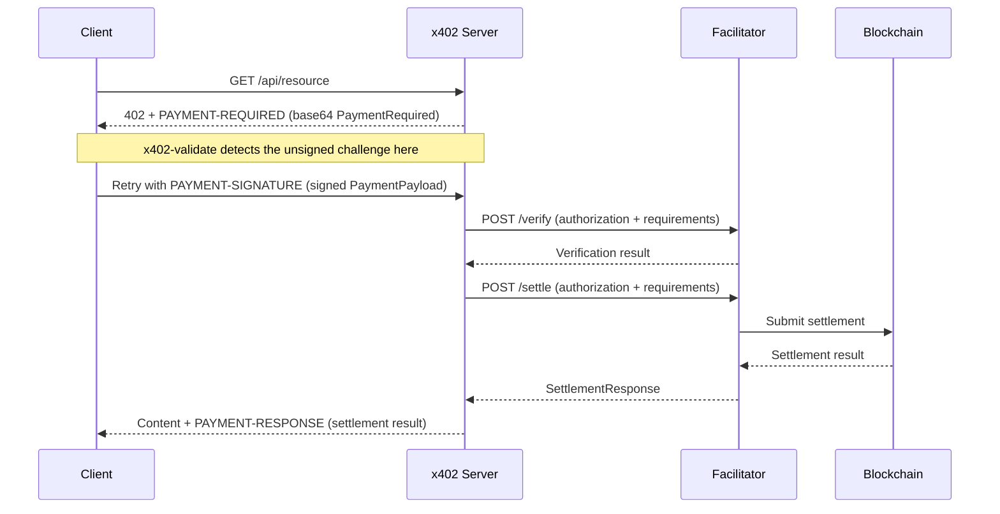
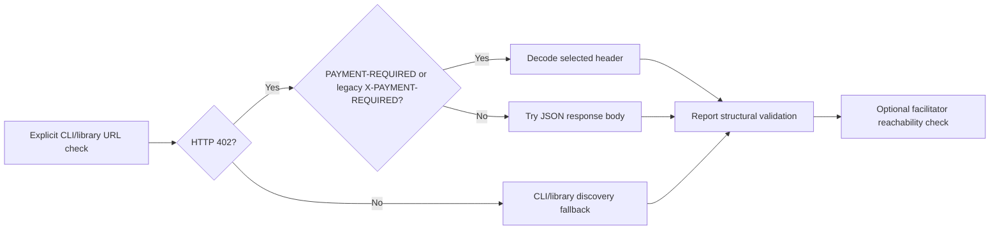
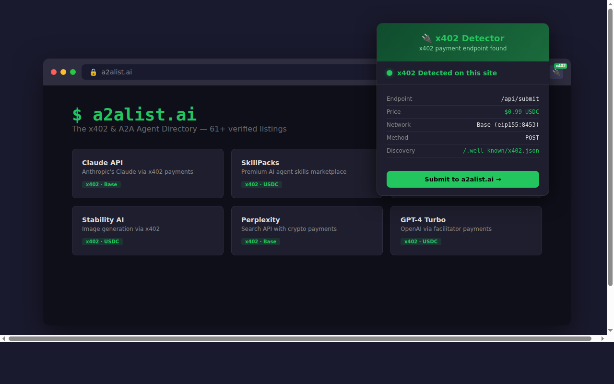
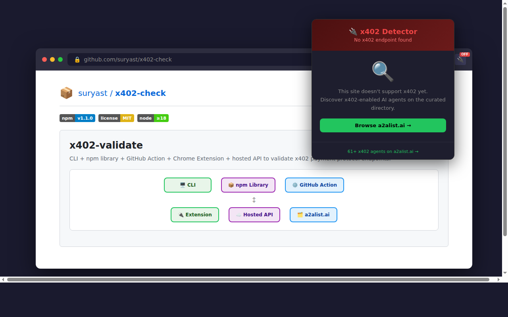
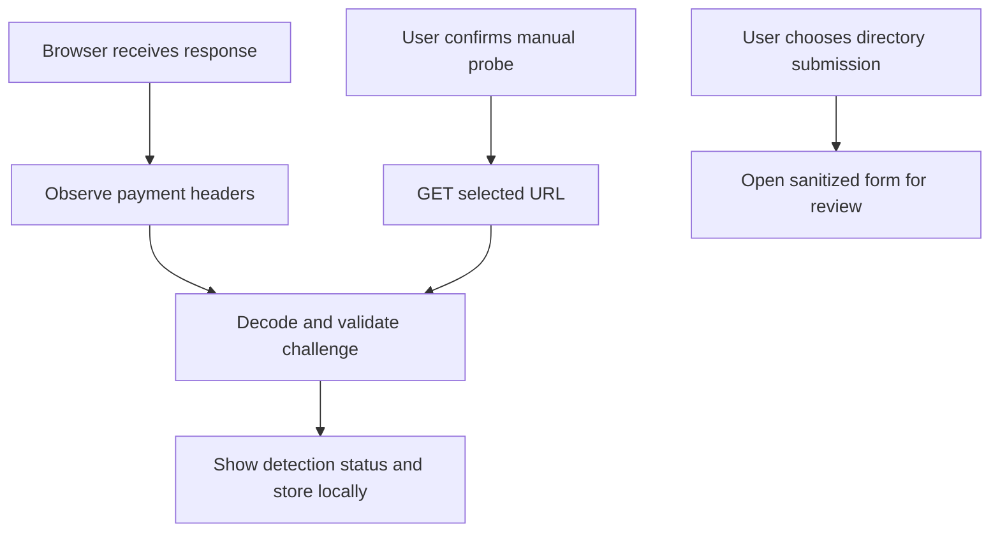

# x402-validate

<p align="center">
  
</p>

<p align="center">
  <a href="https://www.npmjs.com/package/x402-validate"></a>
  <a href="LICENSE"></a>
  <a href="https://nodejs.org">= 18" /></a>
  <a href="https://chromewebstore.google.com/detail/x402-detector/mjaefmlaacmjgfpigilkmnfpjfcckohc"></a>
</p>

**CLI + library + GitHub Action + Chrome Extension** to validate [x402 HTTP payment protocol](https://x402.org) endpoints.

Detects x402 v2 and legacy v1 payment challenges, decodes `PaymentRequired` payloads, and reports structural validation. The CLI/library also support JSON bodies, optional facilitator reachability checks, status badges, and watch mode.

A detected challenge is unsigned server-provided metadata, not proof of merchant identity, payment authorization, or settlement. This tool does not sign payments or send payment authorizations. A reachable facilitator is not proof that a payment can be verified or settled.

---

## Architecture


```mermaid
graph TB
    subgraph "x402-validate Ecosystem"
        CLI["🖥️ CLI<br/>x402-validate &lt;url&gt;"]
        LIB["📦 npm Library<br/>import { checkX402 }"]
        ACTION["⚙️ GitHub Action<br/>CI/CD pipeline"]
        EXT["🔌 Chrome Extension<br/>Browser detection"]
    end

    subgraph "Target"
        SITE["🌐 x402 Site<br/>HTTP 402 + headers"]
        WELL["📋 .well-known/x402.json<br/>Discovery endpoint"]
    end

    subgraph "Integration"
        A2A["🗂️ a2alist.ai<br/>x402 Directory"]
        BADGE["🏷️ Status Badge<br/>SVG via API"]
    end

    CLI -->|probe| SITE
    LIB -->|probe| SITE
    ACTION -->|probe| SITE
    CLI -->|discovery fallback| WELL
    LIB -->|discovery fallback| WELL
    EXT -->|observe response headers| SITE
    EXT -->|user-confirmed GET probe| SITE
    EXT -->|open sanitized submission form| A2A
```

## How x402 Works


```mermaid
sequenceDiagram
    participant C as Client
    participant S as x402 Server
    participant F as Facilitator
    participant B as Blockchain

    C->>S: GET /api/resource
    S-->>C: 402 + PAYMENT-REQUIRED (base64 PaymentRequired)
    Note over C,S: x402-validate detects the unsigned challenge here
    C->>S: Retry with PAYMENT-SIGNATURE (signed PaymentPayload)
    S->>F: POST /verify (authorization + requirements)
    F-->>S: Verification result
    S->>F: POST /settle (authorization + requirements)
    F->>B: Submit settlement
    B-->>F: Settlement result
    F-->>S: SettlementResponse
    S-->>C: Content + PAYMENT-RESPONSE (settlement result)
```

`PAYMENT-REQUIRED` takes precedence over legacy `X-PAYMENT-REQUIRED`. Legacy v1 uses `X-PAYMENT` for authorization and `X-PAYMENT-RESPONSE` for the settlement response.

## Detection Flow


```mermaid
flowchart LR
    A[Explicit CLI/library URL check] --> B{HTTP 402?}
    B -->|Yes| C{PAYMENT-REQUIRED or legacy X-PAYMENT-REQUIRED?}
    C -->|Yes| D[Decode selected header]
    C -->|No| E[Try JSON response body]
    B -->|No| F[CLI/library discovery fallback]
    D --> G[Report structural validation]
    E --> G
    F --> G
    G --> H[Optional facilitator reachability check]
```

---

## Components

| Component | Description | Location |
|-----------|-------------|----------|
| **CLI** | Command-line checker with colored output | `src/cli.ts` |
| **Library** | Importable npm package | `src/index.ts` |
| **GitHub Action** | CI/CD integration, zero deps | `action/` |
| **Chrome Extension** | Browser-native x402 detection | `extension/` |


---

## Quick Start

```bash
# Install globally
npm install -g x402-validate

# Check a URL
x402-validate https://pay.skillpacks.dev/api/skills/security-suite

# Verbose: schema validation + facilitator check
x402-validate --verbose https://pay.skillpacks.dev/api/skills/security-suite

# JSON output for CI
x402-validate --json https://api.example.com/resource | jq .
```

### Output

Illustrative output only; these values are not a current availability or payment-settlement check.

```
✅ x402 DETECTED  https://pay.skillpacks.dev/api/skills/security-suite
  Status:      402
  Network:     eip155:8453
  Scheme:      exact
  Amount:      990000
  Resource:    https://pay.skillpacks.dev/api/skills/security-suite
  Pay to:      0xb92aab592c...
  Schema:      ✅ Valid
  Facilitator: ✅ Reachable (HTTP 200)
```

---

## CLI Reference

```bash
x402-validate [options] <url> [url...]
```

| Flag | Description |
|------|-------------|
| `--json` | Machine-readable JSON output |
| `--verbose` | Schema validation + facilitator check |
| `--timeout <ms>` | Request timeout (default: `10000`) |
| `--file <path>` | Read URLs from file (one per line, `#` comments) |
| `--badge <path>` | Generate SVG status badge |
| `--watch <secs>` | Re-check every N seconds |
| `--help` | Show help |
| `--version` | Show version |

### Exit Codes

| Code | Meaning |
|------|---------|
| `0` | x402 detected on at least one URL |
| `1` | No x402 detected |
| `2` | Error (network, timeout, invalid args) |

### Examples

```bash
# Check multiple URLs
x402-validate https://api.a.com/paid https://api.b.com/endpoint

# Read URLs from file
echo "https://pay.skillpacks.dev/api/skills/security-suite" > urls.txt
x402-validate --file urls.txt

# Generate a badge
x402-validate --badge badge.svg https://api.example.com/resource

# Watch mode — re-check every 60 seconds
x402-validate --watch 60 https://api.example.com/resource

# CI — exits 0 if x402 found
x402-validate https://api.example.com/resource && echo "x402 active!"
```

---

## Library API

```typescript
import {
  checkX402,
  validateSchema,
  checkFacilitator,
  decodePaymentRequired,
} from 'x402-validate';
```

### `checkX402(url, options?)`

```typescript
const result = await checkX402('https://api.example.com/resource', {
  timeout: 10000,
  verbose: true,
  checkFacilitator: true,
});

if (result.supported) {
  console.log('x402 detected!', result.paymentDetails);
  console.log('Schema valid?', result.schemaValidation?.valid);
  console.log('Facilitator up?', result.facilitatorCheck?.reachable);
}
```

### `validateSchema(payload)`

```typescript
// Unsigned challenge adapted from the official v2 specification example.
const validation = validateSchema({
  x402Version: 2,
  resource: {
    url: 'https://api.example.com/premium-data',
    description: 'Access to premium market data',
    mimeType: 'application/json',
  },
  accepts: [{
    scheme: 'exact',
    network: 'eip155:84532',
    amount: '10000',
    asset: '0x036CbD53842c5426634e7929541eC2318f3dCF7e',
    payTo: '0x209693Bc6afc0C5328bA36FaF03C514EF312287C',
    maxTimeoutSeconds: 60,
    extra: { name: 'USDC', version: '2' },
  }],
  extensions: {},
});
console.log(validation.valid);    // true
console.log(validation.errors);   // []
```

### `checkFacilitator(url, timeout?)`

```typescript
const fc = await checkFacilitator('https://facilitator.example.com', 5000);
// fc.reachable: true if 2xx/3xx
```

---

## GitHub Action

Zero-dependency JavaScript action using the GitHub Actions Node.js 24 runtime. It checks HTTP 402 headers only (v2 `PAYMENT-REQUIRED`, then legacy v1 `X-PAYMENT-REQUIRED`) and rejects malformed challenge schemas. Unlike the CLI/library, it does not parse JSON bodies, follow redirects, probe discovery documents, or check facilitators. Its `payment` result field contains the decoded challenge; the library calls this field `paymentDetails`.

The action lives in `action/`, so include that subdirectory in `uses`. Pin a reviewed commit SHA for production workflows; the examples below use the development branch, not a published 1.2.0 release.

```yaml
- name: Verify x402 endpoint
  uses: suryast/x402-check/action@master
  with:
    urls: |
      https://pay.skillpacks.dev/api/skills/security-suite
      https://a2alist.ai/api/submit
    fail-on-missing: 'true'
    timeout: '15000'
```

### Inputs

| Input | Required | Default | Description |
|-------|----------|---------|-------------|
| `urls` | ✅ | — | Newline-separated URLs to check |
| `fail-on-missing` | ❌ | `true` | Fail if no checked URL has a valid x402 challenge |
| `timeout` | ❌ | `10000` | Request timeout in ms |

### Outputs

| Output | Description |
|--------|-------------|
| `results` | JSON array of check results |
| `found-count` | Number of URLs with x402 |
| `total-count` | Total URLs checked |

### Workflow Examples

```yaml
# Scheduled monitoring
name: x402 Monitor
on:
  schedule:
    - cron: '0 */6 * * *'  # Every 6 hours
jobs:
  check:
    runs-on: ubuntu-latest
    steps:
      - uses: suryast/x402-check/action@master
        with:
          urls: https://pay.skillpacks.dev/api/skills/security-suite
          fail-on-missing: 'true'

# PR gate — ensure x402 stays active
name: x402 Gate
on: [pull_request]
jobs:
  verify:
    runs-on: ubuntu-latest
    steps:
      - uses: suryast/x402-check/action@master
        id: x402
        with:
          urls: https://your-api.com/paid-endpoint
          fail-on-missing: 'true'
      - run: echo "Found ${{ steps.x402.outputs.found-count }} x402 endpoints"
```

---

## Chrome Extension

MV3 Chrome extension that passively detects x402 endpoints while you browse.

### Features

- 🟢 Green **x402** badge when x402 detected on current site
- 🔴 Red **OFF** badge when no x402 found
- Observes response headers without replaying requests or probing discovery paths automatically
- Offers an explicit, user-confirmed GET probe
- Stores discovered x402 sites locally
- Opens a sanitized [a2alist.ai](https://a2alist.ai) submission form for user review
- Export discovered sites as JSON
- Built-in directory browser (powered by a2alist.ai)

### Screenshots

| x402 Detected | Not Found |
|:-:|:-:|
|  |  |

### Install

**From Chrome Web Store (recommended):**

[](https://chromewebstore.google.com/detail/x402-detector/mjaefmlaacmjgfpigilkmnfpjfcckohc)

**Manual (developer mode):**

1. Download or clone `extension/` directory
2. Open `chrome://extensions`
3. Enable **Developer mode**
4. Click **Load unpacked** → select `extension/`

### How It Works


```mermaid
flowchart TD
    A[Browser receives response] --> B[Observe payment headers]
    B --> C[Decode and validate challenge]
    C --> D[Show detection status and store locally]
    E[User confirms manual probe] --> F[GET selected URL]
    F --> C
    G[User chooses directory submission] --> H[Open sanitized form for review]
```

### Privacy

- No data sent automatically — submission is user-initiated only
- Discovered sites stored locally in `chrome.storage.local`
- Passive detection does not send probes, replay requests, or fetch discovery paths
- A manual GET probe requires user confirmation; directory submissions are never automatic

---

---

## Project-specific discovery convention (legacy)

The CLI/library support the project-specific `/.well-known/x402.json` convention. It is not part of the canonical x402 v2 HTTP transport specification, and the extension does not probe it automatically. Sites that use x402 on specific endpoints (not the homepage) can advertise their x402 support:

```json
{
  "x402Version": 1,
  "endpoints": [
    {
      "path": "/api/submit",
      "method": "POST",
      "description": "Paid API endpoint",
      "price": "$0.99 USDC",
      "network": "eip155:8453"
    }
  ]
}
```

An explicit CLI/library check may request this document as a discovery fallback. This is an active request, not passive browser observation.

---

## Types

<details>
<summary>TypeScript interfaces</summary>

### `X402Result`

```typescript
interface X402Result {
  url: string;
  supported: boolean;
  status: number;
  paymentDetails?: PaymentRequired;
  rawHeader?: string;
  headers?: Record<string, string>;
  error?: string;
  schemaValidation?: ValidationResult;
  facilitatorCheck?: FacilitatorResult;
}
```

### `ValidationResult`

```typescript
interface ValidationResult {
  valid: boolean;
  errors: string[];
  warnings: string[];
}
```

### `FacilitatorResult`

```typescript
interface FacilitatorResult {
  url: string;
  reachable: boolean;
  status?: number;
  error?: string;
}
```

`ResourceInfo` contains `url` and optional `description`/`mimeType`. `AcceptsEntryV2` requires `scheme`, CAIP-2 `network`, atomic-unit `amount`, `asset`, `payTo`, and positive integer `maxTimeoutSeconds`; `extra` is optional. Legacy v1 `AcceptsEntry` uses `maxAmountRequired` and embeds resource metadata in each option. See `src/types.ts` for the complete exported interfaces.

### `PaymentRequired`

```typescript
interface PaymentRequired {
  x402Version?: number;
  accepts?: (AcceptsEntry | AcceptsEntryV2)[];
  resource?: string | ResourceInfo;
  // v2 extension map entries contain info and schema objects.
  [key: string]: unknown;
  facilitatorUrl?: string;
  scheme?: string;
  network?: string;
  maxAmountRequired?: string;
}
```

</details>

---

## 1.2.0 changes

- Adds canonical x402 v2 challenge fields and CAIP-2 validation while retaining legacy v1 support.
- Gives `PAYMENT-REQUIRED` precedence over `X-PAYMENT-REQUIRED`.
- Updates the standalone Action to validate v1/v2 headers and use Node.js 24 on GitHub runners.
- Keeps the npm library/CLI Node.js >=18 compatibility target; the Action runtime is separate.
- Documents passive extension detection and explicit user-confirmed probes.

npm, GitHub Action tags, and Chrome Web Store versions are released separately; check each distribution channel for availability.

## Related

- [x402.org](https://x402.org) — x402 protocol
- [Official v2 specification](https://github.com/coinbase/x402/blob/main/specs/x402-specification-v2.md) — challenge schema and payment flow
- [GitHub Action metadata](https://docs.github.com/en/actions/reference/workflows-and-actions/metadata-syntax) — supported JavaScript action runtimes
- [coinbase/x402](https://github.com/coinbase/x402) — Reference implementation
- [a2alist.ai](https://a2alist.ai) — x402 & A2A agent directory
- [skillpacks.dev](https://skillpacks.dev) — AI skills marketplace (x402-powered)

---

## License

MIT © [a2alist.ai](https://a2alist.ai)
